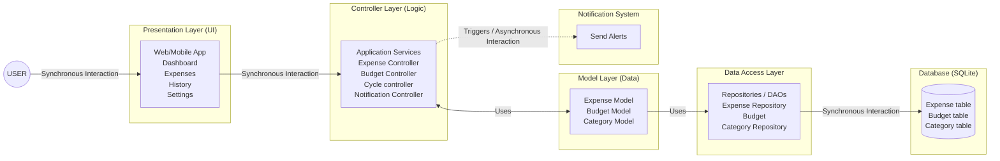
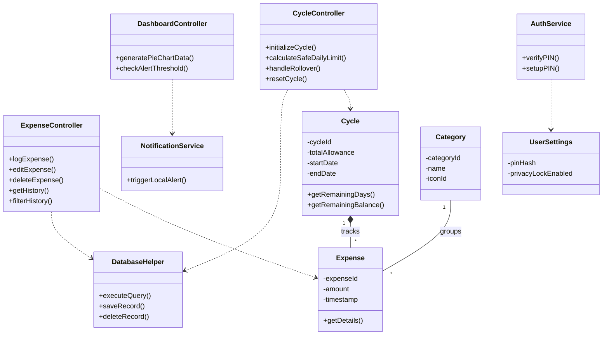
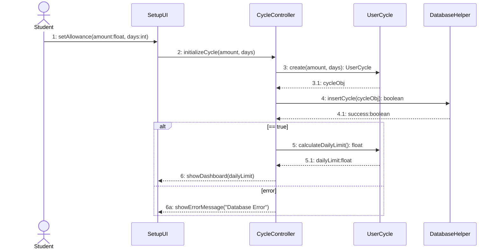
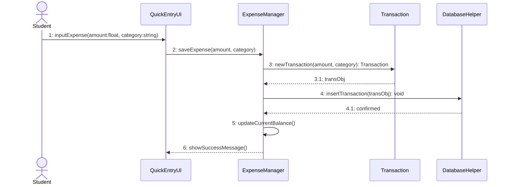
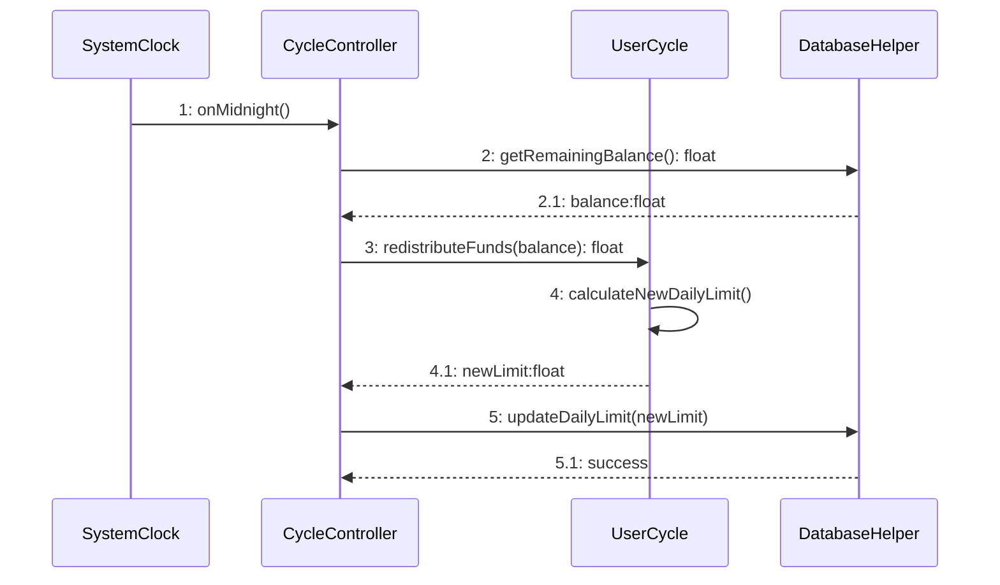
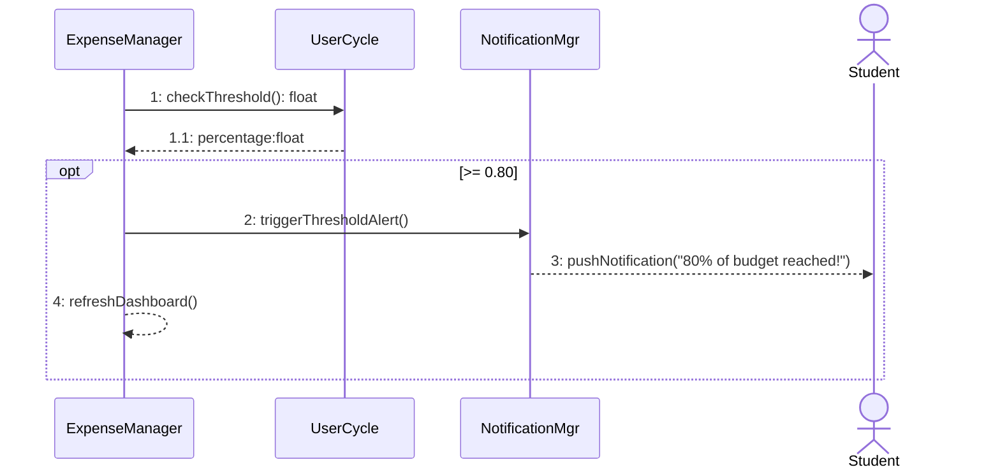
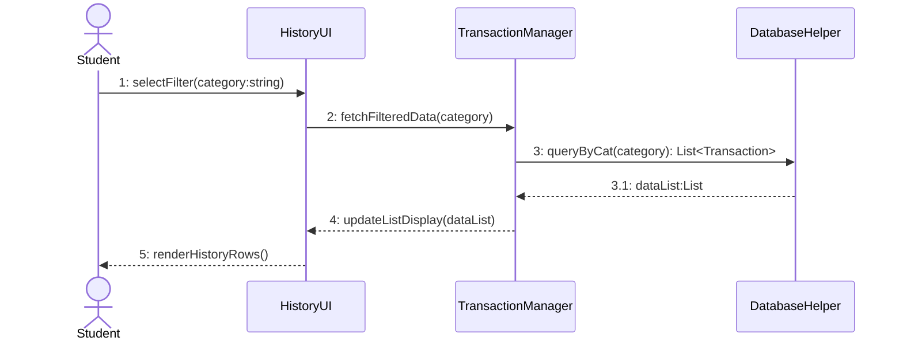
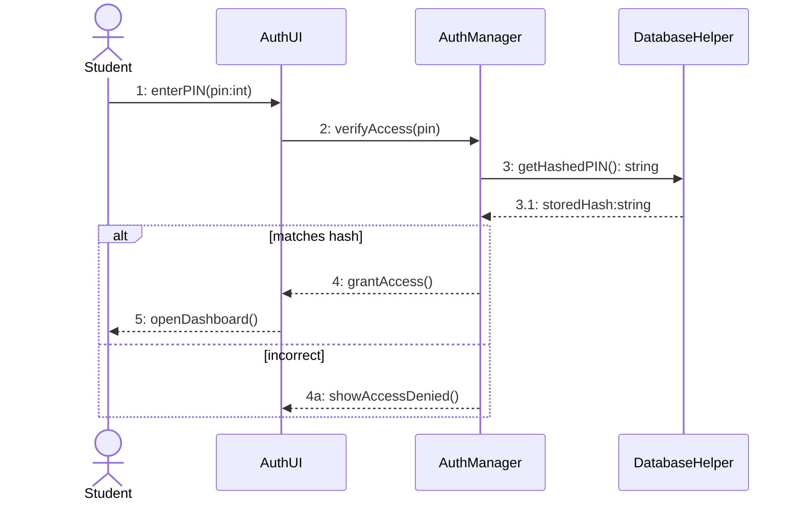
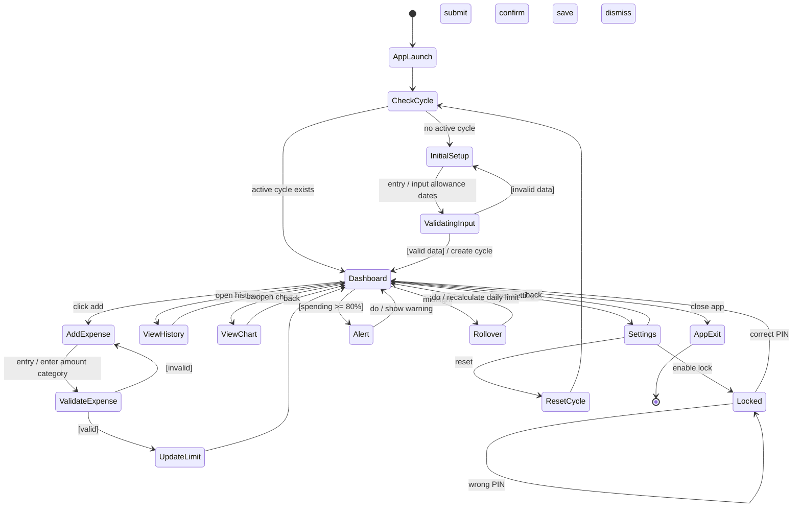

# CS251 Project: Masroofy Budgeting App
## Software Design Specification v1.0

**Course:** CS251 - Introduction to Software Engineering  
**University:** Cairo University, Faculty of Computers and Artificial Intelligence  
**Team:** S26  
**Date:** April 2026  

### Team Members
| ID | Name | Email | Mobile |
| :--- | :--- | :--- | :--- |
| 20242447 | Yehia Hassan Abdelmoaty | 20242447@stud.fci-cu.edu.eg | 01205309575 |
| 20240794 | Noha Mohamed Ahmed | 20240794@stud.fci-cu.edu.eg | 01007021975 |
| 20240759 | Jana Ahmed Farahat Hassan | 20240759@stud.fci-cu.edu.eg | 01281727773 |
| 20240650 | Hana Khaled Abdelhamed | 20240650@stud.fci-cu.edu.eg | 01060820155 |

---

## Contents
1. Document Purpose and Audience
2. System Models
   - I. Architecture Diagram
   - II. Class Diagram(s)
   - III. Class Descriptions
   - IV. Sequence diagrams
   - Class - Sequence Usage Table
   - V. State Diagram
   - VI. SOLID Principles
   - VII. Design Patterns
3. Tools
4. Ownership Report

---

## Document Purpose and Audience

**Document Purpose**
This Software Design Specification (SDS) provides the technical blueprint for the budgeting application. It translates the functional requirements into concrete architectural and structural designs, defining the specific principles and design patterns required to build a scalable and maintainable system.

**Target Audience**
This document is intended for the project's participants, including the software development team, software architects, quality assurance testers, and project managers. It serves as a definitive guide for coding, validating system architecture, developing test cases, and verifying that the technical design strictly maps to the established project scope.

---

## System Models

### I. Architecture Diagram

#### 1. System Components and Subsystems
The system is structured using a layered approach based on the MVC pattern. Each component has a clear responsibility to ensure separation of concerns and maintainability.

1. **User (Client)**
   * The user represents the end actor who interacts with the system through a web or mobile interface.
   * The user performs actions such as adding expenses, viewing history, and managing budget data.
2. **View Layer (Presentation Layer)**
   * The View layer is responsible for the user interface and user experience.
   * **Responsibilities:**
     * Displaying data to the user
     * Collecting user input
     * Rendering screens such as: Dashboard, Add Expense, History, Settings
   * This layer does not contain business logic; it only communicates with the Controller.
3. **Controller Layer (Application Logic)**
   * The Controller layer acts as the intermediary between the View and the Model.
   * **Responsibilities:**
     * Handling user requests from the View
     * Validating input data
     * Applying business rules
     * Calling the appropriate Model functions
     * Returning results back to the View
   * **Examples of controllers:** Expense Controller, Budget Controller, Cycle Controller.
4. **Model Layer (Data & Business Logic)**
   * The Model layer represents the core data and business rules of the system.
   * **Responsibilities:**
     * Managing application data
     * Defining entities and their relationships
     * Applying core business logic
   * **Examples of models:** Expense Model, Budget Model, Category Model.
   * The Model communicates with the Database to store and retrieve data.
5. **Database Layer**
   * The Database layer is responsible for persistent data storage.
   * **Responsibilities:**
     * Storing all system data
     * Providing data retrieval and update operations
   * **Example tables:** Expenses Table, Budgets Table, Categories Table.

#### 2. Architectural Design
The system follows the Model-View-Controller (MVC) architectural pattern.
* **Why MVC was chosen:**
  * Ensures separation of concerns
  * Improves code maintainability
  * Allows independent development of UI and logic
  * Enhances scalability and testing
* **How the system works (Flow):**
  1. The User interacts with the View (UI)
  2. The View sends the request to the Controller
  3. The Controller processes the request and calls the Model
  4. The Model interacts with the Database
  5. The result is returned back: Model -> Controller -> View -> User

#### 3. Architectural Diagram

---

### II. Class Diagram(s)

---

### III. Class Descriptions

| Class ID | Class Name | Description & Responsibility |
| :--- | :--- | :--- |
| 1. | Cycle | Represents the user's budget cycle. Tracks the total cash allowance, start/end dates, and calculates remaining days. |
| 2. | Expense | Represents a logged financial transaction. Stores the numerical amount, timestamp, and linked category ID. |
| 3. | Category | Represents a lifestyle spending group (e.g., Food, Transport) used to classify expenses. |
| 4. | UserSettings | Stores the user's hashed 4-digit PIN and the boolean flag for the privacy lock. |
| 5. | CycleController | Manages the core budget timeframe logic. Responsible for initializing allowances, calculating the "Safe Daily Limit", managing midnight rollovers, and resetting cycles. |
| 6. | ExpenseController | Handles the logic for rapid manual expense logging, filtering transaction history by date/category, and editing/deleting past entries. |
| 7. | DashboardController | Processes mathematical data for the UI view. Generates pie chart percentages for visual spending insights and monitors the 80% usage threshold. |
| 8. | DatabaseHelper | Manages the local SQLite database engine to persist cycles and transactions securely on the device without internet access. |
| 9. | NotificationService | Triggers local device push notifications when budget thresholds are breached to warn the user. |
| 10. | AuthService | Authenticates the user via the 4-digit PIN or biometric lock before granting application access. |

---

### IV. Sequence diagrams

#### 1. Set Initial Budget Cycle

#### 2. Log Daily Expense

#### 3. Automatic Midnight Rollover

#### 4. Threshold Alert (80% Spending)

#### 5. View History & Filters

#### 6. Set/Verify Privacy PIN

---

### Class - Sequence Usage Table

| Sequence Diagram | Classes Used | All Methods Used |
| :--- | :--- | :--- |
| 1. Set Initial Cycle | CycleController, UserCycle, DatabaseHelper | initializeCycle(), createNewCycle(), calculateDailyLimit() |
| 2. Log Expense | ExpenseManager, Transaction, DatabaseHelper | saveExpense(), newTransaction(), insertTransaction() |
| 3. Midnight Rollover | CycleController, UserCycle, DatabaseHelper | onMidnight(), redistributeFunds(), updateDailyLimit() |
| 4. Threshold Alert | ExpenseManager, UserCycle, NotificationMgr | checkThreshold(), triggerThresholdAlert(), pushNotification() |
| 5. View History | TransactionManager, DatabaseHelper | fetchFilteredData(), queryByCat(), updateListDisplay() |
| 6. Privacy PIN | AuthManager, DatabaseHelper | verifyAccess(), getHashedPIN(), grantAccess() |

---

### V. State Diagram

---

### VI. SOLID Principles

1. **Single Responsibility Principle (SRP)**
   * **Where it was applied:** The separation between the Expense Controller and the DatabaseHelper.
   * **Explanation:** According to SRP, a class should have only one reason to change. In our design, the ExpenseController handles only the business logic (validating expense amounts, categorizing). It delegates all data persistence to the DatabaseHelper. If the SQLite query syntax changes, only the DatabaseHelper is modified; if the logic for calculating remaining balances changes, only the Controller is modified.
2. **Open/Closed Principle (OCP)**
   * **Where it was applied:** The AuthService and system security checks.
   * **Explanation:** The software is open for extension but closed for modification. Currently, Masroofy uses a 4-digit PIN for the privacy lock. The AuthService is designed so that if we want to introduce Biometric (Fingerprint/FaceID) locks in future updates, we can extend the authentication modules without modifying or breaking the existing PIN-checking codebase.
3. **Dependency Inversion Principle (DIP)**
   * **Where it was applied:** The relationship between high-level controllers (e.g., CycleController) and data access (DatabaseHelper).
   * **Explanation:** High-level modules should not depend on low-level modules. Instead of the controllers executing raw SQLite queries directly (which tightly couples them to a specific database engine), they depend on the abstract methods provided by DatabaseHelper (like saveRecord()). This abstraction makes the system easier to test and maintain.

---

### VII. Design Patterns

1. **Singleton Pattern**
   * **Where you used it:** The Database Helper class.
   * **Benefit of using it:** It ensures the application only ever creates one single connection to the local SQLite database. This prevents database file-locking crashes and memory leaks on the user's mobile device.
2. **Observer Pattern**
   * **Where you used it:** The interaction between the ExpenseController, Dashboard Controller, and NotificationService.
   * **Benefit of using it:** It allows parts of the app to automatically react to changes. When a user adds a new expense, the dashboard chart immediately updates and the system checks if a warning notification is needed, all without the controllers being tightly linked together.
3. **Facade Pattern**
   * **Where you used it:** The Database Helper class acting as an interface for the Controllers.
   * **Benefit of using it:** It hides the complex, low-level code required to manage native SQLite database connections. Instead of dealing with complex database cursors and queries, the rest of the app just uses simple, clean methods like saveRecord().

---

## Tools
* https://www.plantuml.com/ for Class, State, and Sequence Diagrams

## Ownership Report

| Name | Work done |
| :--- | :--- |
| Yehia Hassan Abdelmoaty | Class Diagram and Descriptions |
| Noha Mohamed Ahmed | State diagram |
| Jana Ahmed Farhat Hassan | Architecture Diagram and Descriptions |
| Hana Khaled Abdelhamed | Sequence Diagram and Descriptions |
